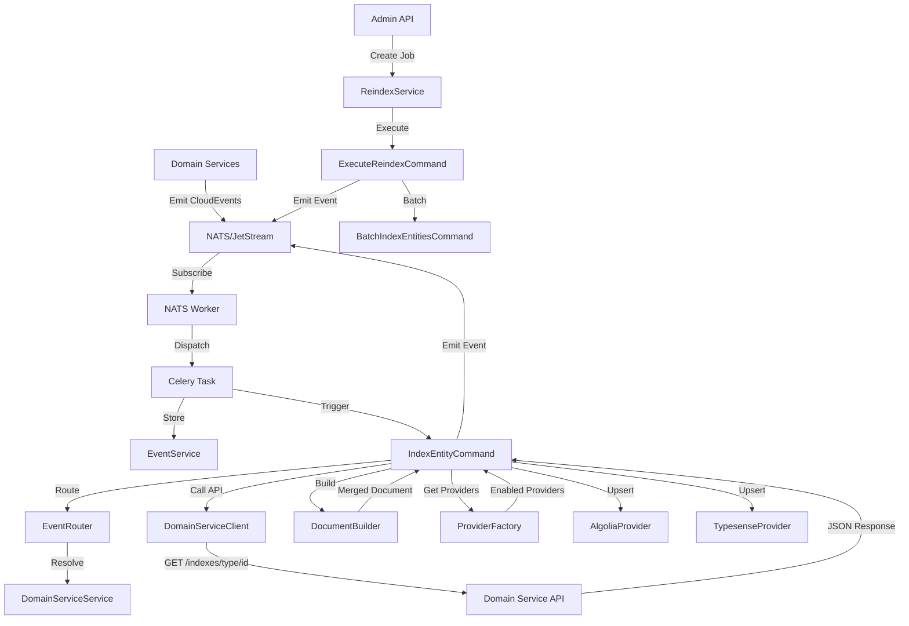

# Indexa Architecture Documentation

## Overview

Indexa is a centralized search indexing platform that consumes events from domain services and indexes entities into search providers (Algolia, Typesense, etc.). It provides a unified interface for managing search indexes across multiple domain services.

## System Flow

### Event-Driven Indexing Flow

```
Domain Service → NATS/JetStream → NATS Worker → Celery Task → Event Storage → IndexEntityCommand
                                                                                    ↓
                                            DomainServiceClient → Domain Service API → Document Builder
                                                                                            ↓
                                            ProviderFactory → Search Providers (Algolia, Typesense)
```

### High-Level Architecture



## Components

### 1. Service Registration

**Purpose**: Register domain services and their ownership of event domains.

**Key Components**:
- `DomainService` model: Stores service registration data
- `DomainServiceService`: Database operations for service management
- Domain Service Router: Admin API for CRUD operations

**API Endpoints**:
- `POST /domain-services` - Register a service
- `GET /domain-services` - List services (paginated)
- `GET /domain-services/{id}` - Get service details
- `PUT /domain-services/{id}` - Update service
- `DELETE /domain-services/{id}` - Unregister service

**Registration Fields**:
- `service_name`: Name of the domain service
- `domains`: Array of domain prefixes (e.g., `["com.identies"]`)
- `base_url`: Base URL for the service's indexing API
- `indexes_path_prefix`: Path prefix for indexing endpoints
- `excluded_entities`: Optional list of entity types to exclude
- `enabled`: Enable/disable flag

### 2. Event Routing

**Purpose**: Route incoming events to their owning domain service.

**Key Components**:
- `EventRouter`: Utility for resolving domain service from event type
- Domain matching logic: Matches event types to registered domains

**Process**:
1. Extract domain prefix from `event_type` (e.g., "com.identies.user.updated" → "com.identies")
2. Match against registered domain services
3. Return owning service or None (dead-letter)

### 3. Document Building

**Purpose**: Build search documents from domain service API responses.

**Key Components**:
- `DocumentBuilder`: Utilities for building documents
- `SearchDocument` schema: Flexible document structure

**Process**:
1. Extract entity type and ID from event `subject` field
2. Call domain service API: `GET {base_url}/{indexes_path_prefix}/{entity_type}/{entity_id}`
3. Domain service returns complete JSON document structure
4. Merge with Indexa core fields: `id`, `type`, `schema_version`, `updated_at`
5. Return merged document (preserves domain service JSON structure)

**Core Fields**:
- `id`: Deterministic ID (`{entity_type}_{entity_id}`)
- `type`: Entity type
- `schema_version`: Schema version (default: "1.0")
- `updated_at`: Timestamp

### 4. Search Provider Abstraction

**Purpose**: Abstract different search providers behind a common interface.

**Key Components**:
- `SearchProvider` ABC: Base interface
- `AlgoliaProvider`: Algolia implementation
- `TypesenseProvider`: Typesense implementation (optional)
- `ProviderFactory`: Factory for creating enabled providers

**Provider Configuration**:
- Static configuration (env vars): `ALGOLIA_APP_ID`, `ALGOLIA_API_KEY`, etc.
- Dynamic enable/disable: `AppSetting` model (`provider.algolia.enabled`)

**Methods**:
- `upsert(document)`: Upsert a single document
- `upsert_batch(documents)`: Batch upsert
- `delete(document_id)`: Delete a document
- `delete_batch(document_ids)`: Batch delete
- `ensure_index(index_name)`: Ensure index exists
- `healthcheck()`: Health check

### 5. Indexing Pipeline

**Purpose**: Process events and index entities.

**Key Components**:
- `IndexEntityCommand`: Command for indexing a single entity
- `process_nats_event_task`: Celery task that processes NATS events

**Process**:
1. NATS event received → stored in database
2. Event routed to domain service
3. Entity type/ID extracted from subject
4. Check if entity type is excluded
5. Call domain service API to get entity data
6. Build document
7. Upsert to all enabled providers
8. Emit indexing success/failure events

### 6. Reindexing System

**Purpose**: Batch reindex entities from domain services.

**Key Components**:
- `ReindexJob` model: Tracks reindex jobs
- `ReindexService`: Database operations for job management
- `ExecuteReindexCommand`: Command for executing reindex jobs
- `BatchIndexEntitiesCommand`: Command for batch indexing

**API Endpoints**:
- `POST /reindex` - Create and trigger reindex job
- `GET /reindex` - List reindex jobs (paginated)
- `GET /reindex/{job_id}` - Get job status
- `POST /reindex/{job_id}/cancel` - Cancel running job

**Job Configuration**:
- `scope`: Job scope (e.g., "domain", "workspace", "global")
- `domains`: Filter by domain prefixes
- `entity_types`: Filter by entity types
- `providers`: Target providers
- `updated_after`/`updated_before`: Date range filtering
- `mode`: "upsert" or "replace"

**Process**:
1. Create reindex job
2. Trigger async Celery task
3. For each matching domain service:
   - For each entity type:
     - Call domain service batch ingest API
     - Process paginated results
     - Build documents and upsert to providers
     - Update job progress
4. Update job status (completed/failed)
5. Emit reindex events

## Domain Service API Contract

### Single Entity Endpoint

**Pattern**: `GET {base_url}/{indexes_path_prefix}/{entity_type}/{entity_id}`

**Example**: `GET https://pets-service.internal/indexes/pets/123`

**Authentication**: Bearer token (M2M service account token)

**Response**: JSON document structure that the domain service wants indexed

### Batch Ingest Endpoint

**Pattern**: `GET {base_url}/{indexes_path_prefix}/{entity_type}?updated_after={date}&updated_before={date}&page={page}&per_page={per_page}`

**Example**: `GET https://pets-service.internal/indexes/pets?updated_after=2024-01-01T00:00:00Z&page=1&per_page=100`

**Query Parameters**:
- `updated_after`: ISO 8601 datetime (optional)
- `updated_before`: ISO 8601 datetime (optional)
- `page`: Page number (default: 1)
- `per_page`: Items per page (default: 100)

**Response**: Paginated list of entities
```json
{
  "data": [...],
  "pagination": {
    "page": 1,
    "per_page": 100,
    "total": 500,
    "total_pages": 5
  }
}
```

## Command Pattern

**Principle**: Services are database-only; commands handle external interactions.

**Services** (Database-only):
- `DomainServiceService`
- `ReindexService`
- `IndexingService`

**Commands** (External interactions + event emission):
- `IndexEntityCommand`: Indexes a single entity, calls domain APIs, interacts with providers, emits events
- `BatchIndexEntitiesCommand`: Batch indexes entities, calls domain APIs, interacts with providers
- `ExecuteReindexCommand`: Executes reindex jobs, orchestrates batch commands, emits events

## Event Types

### Indexing Events
- `com.indexa.indexing.entity.indexed`: Entity successfully indexed
- `com.indexa.indexing.entity.indexing_failed`: Entity indexing failed

### Reindex Events
- `com.indexa.indexing.reindex.started`: Reindex job started
- `com.indexa.indexing.reindex.completed`: Reindex job completed
- `com.indexa.indexing.reindex.failed`: Reindex job failed

## Observability

### Metrics
- `indexing_events_total`: Counter by service, status, entity_type
- `indexing_duration_seconds`: Histogram by entity_type, provider
- `provider_operations_total`: Counter by provider, operation, status
- `provider_latency_seconds`: Histogram by provider, operation
- `reindex_jobs_total`: Counter by status
- `reindex_progress`: Gauge by job_id

### Logging
- Structured logging throughout commands
- Log unregistered domains, indexing failures, provider errors

## Configuration

### Environment Variables
- `ALGOLIA_APP_ID`: Algolia application ID
- `ALGOLIA_API_KEY`: Algolia API key
- `ALGOLIA_INDEX_PREFIX`: Index prefix (default: "linden_")
- `TYPESENSE_HOST`: Typesense host
- `TYPESENSE_API_KEY`: Typesense API key
- `TYPESENSE_PORT`: Typesense port (default: 443)

### AppSetting Model (Dynamic)
- `provider.algolia.enabled`: Enable/disable Algolia (boolean as string: "true"/"false")
- `provider.typesense.enabled`: Enable/disable Typesense (boolean as string: "true"/"false")

## Error Handling

- Indexing failures don't fail event storage
- Retry logic with exponential backoff for domain service API calls
- Provider errors are logged and reported via metrics
- Failed indexing operations emit failure events

## Security

- M2M token authentication for domain service API calls
- RBAC for admin APIs (service registration, reindex jobs)
- Service account tokens obtained via `M2MTokenClient`
